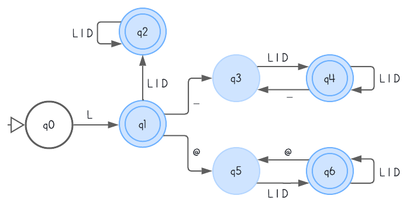
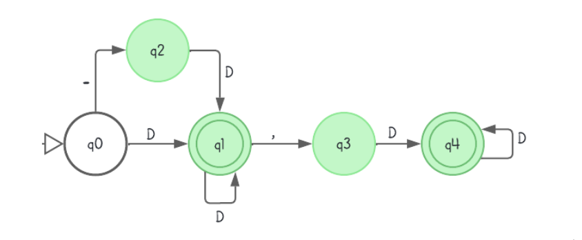
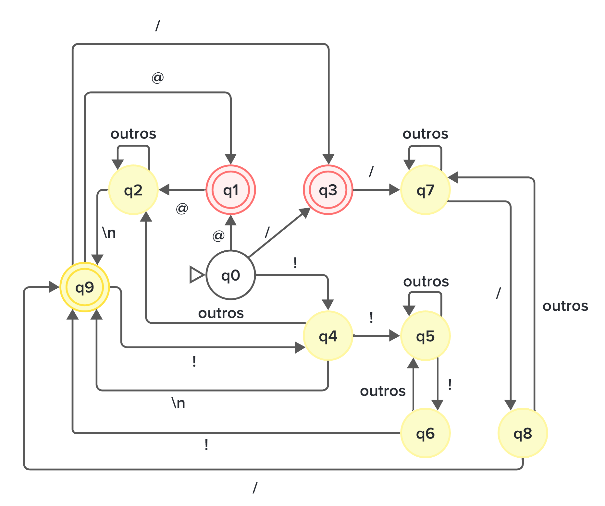
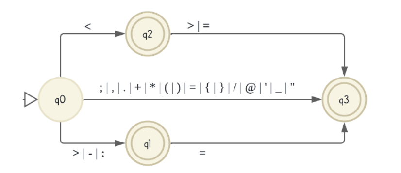

# Compilador

Compilador para a disciplina de Compiladores. Abaixo estão as especificações para o analisador léxico:

## Identificadores

Os identificadores são compostos por letras (maiúsculas ou minúsculas), números, e os caracteres _ (underscore) e @ (arroba). Eles devem iniciar necessariamente com uma letra. É crucial notar que eles não podem começar ou terminar com _ (underscore) ou @ (arroba). Além disso, se o identificador contiver o caractere @ (arroba), não pode conter o _ (underscore) simultaneamente.

### Exemplos de identificadores válidos:
- i
- jx
- soma
- k12aa3b
- z_teste
- u_teste123a_b
- u_12tes3
- s_o_mapesonota
- somaPeso
- K_PESO_TOTAL
- u@rio
- c@m@inhao

### Exemplos de identificadores inválidos:
- 1xPeso
- 24kg
- _palavras
- soma__peso
- automato_
- @user
- case@uespi_olx
- numero@@dois
- teste@
- numero@dois

## Palavras Reservadas

O analisador léxico deve ser capaz de reconhecer palavras reservadas, que têm significados específicos dentro da linguagem de programação.

### Palavras reservadas que devem ser reconhecidas:
- principal
- if
- then
- else
- while
- do
- until
- repeat
- int
- double
- char
- case
- switch
- end
- procedure
- function
- for
- begin

## Símbolos Especiais

O analisador léxico deve ser capaz de reconhecer uma variedade de símbolos e operadores essenciais na análise do código-fonte.

### Símbolos especiais que devem ser reconhecidos:
- ;
- ,
- .
- \+
- \-
- \*
- (
- )
- <
- \>
- :
- =
- {
- }
- :=
- <>
- <=
- \>=
- /
- @
- -=

## Comentários

Os comentários de uma linha devem começar com ! (ponto de exclamação) e os comentários de múltiplas linhas devem iniciar e finalizar com !! (dois pontos de exclamação).

### Exemplos de comentários de uma linha:
- ! Esse é um comentário de uma linha!
- ! Outro comentário de uma linha.
- @@ Outro comentário de uma linha.

### Exemplos de comentários de múltiplas linhas:
- !! Esse é um comentário de múltiplas linhas! Isso é importante na documentação de todas as linguagens de programação.!!
- // Outro comentário de múltiplas linhas! //

## Dígitos

O analisador léxico deve identificar números inteiros (positivos ou negativos) compostos por uma ou mais dígitos, e também reconhecer números decimais (positivos ou negativos) formados por uma parte inteira seguida por uma vírgula e uma parte decimal.

### Exemplos de dígitos válidos:
- 1
- 12
- -5
- -54
- 1,5
- 254,8
- -123,4
- -12,55

## Autmatos
Os autômatos são essenciais na análise e reconhecimento de padrões dentro do código-fonte, permitindo a identificação de tokens, como identificadores, palavras reservadas, símbolos especiais e números.

## Identificadores e Palavras Reservadas

## Dígitos

## Comentários

## Símbolos Especiais

